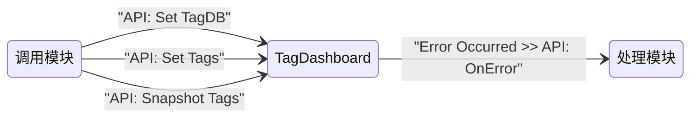

# `TagDashboard` — CSM 模块接口文档

---

## 功能简述

`TagDashboard` 是一个 CSM UI 模块，用于将 TagDB 中的标签（Tag）数据以网格仪表盘（Grid Dashboard）形式展示在前面板上。

模块支持动态设置仪表盘的行列数、指定要监听的标签列表，并可随时对当前标签值进行快照式刷新。

---

## 模块信息

| 属性           | 值                                              |
| -------------- | ----------------------------------------------- |
| LabVIEW 版本   | ≥ 2020                                          |
| 支持的操作系统 | Windows                                         |
| 支持 RT        | ❌ 不支持                                       |
| 支持 64-bit    | ✅ 支持                                         |
| 所属模块组     | CSM-TagDashboard.lvlib                           |

---

## 依赖项

| 依赖                                                                                                | 类型 |
| --------------------------------------------------------------------------------------------------- | ---- |
| [Communicable-State-Machine](https://github.com/NEVSTOP-LAB/Communicable-State-Machine)             | 必须 |
| [CSM-API-String-Arguments-Support](https://github.com/NEVSTOP-LAB/CSM-API-String-Arguments-Support) | 必须 |
| [CSM-INI-Static-Variable-Support](https://github.com/NEVSTOP-LAB/CSM-INI-Static-Variable-Support)   | 可选 |
| [TagDB](https://github.com/NEVSTOP-LAB/TagDB)                                                      | 必须 |
| [TagDB RefManager](https://github.com/NEVSTOP-LAB/TagDB)                                           | 必须 |

---

## API 接口（消息接口）

以下是外部调用者可以发送给本模块的消息。

### `API: Set TagDB`

绑定目标 TagDB 引用，建立与 TagDB 服务器的连接。

- **参数**：`APIString` — `String`：TagDB 引用名称或标识符
- **响应**：N/A

### `API: Set Tags`

指定要在仪表盘上显示的标签（Tag）列表。

- **参数**：`APIString` — `String`：以逗号或分号分隔的标签名称列表（如 `TagA,TagB,TagC`）
- **响应**：N/A

### `API: Snapshot Tags`

立即刷新仪表盘上所有已注册标签的当前值。

- **参数**：N/A
- **响应**：N/A

### `UI: Front Panel State`

控制本模块前面板的显示状态。

- **参数**：`APIString` — `Enum`：`Open`、`Close` 或 `Minimize`
- **响应**：N/A

### `UI: Cursor Set`

设置前面板光标样式。

- **参数**：`APIString` — `Enum`：光标类型名称（如 `Busy`、`Default`）
- **响应**：N/A

### 参数类型说明

| 类型        | 说明                                                                                              |
| ----------- | ------------------------------------------------------------------------------------------------- |
| `APIString` | 支持嵌套键值对的纯文本字符串，需要 CSM API String Arguments Support 插件                          |
| `${变量名}` | INI 配置变量引用，需要 CSM INI Static Variable Support 插件                                       |

> **注意**：接口文档中对 `String` 类型数据统一使用 `APIString` 标注（不直接写 `SafeStr`），因为 `SafeStr` 正是 `APIString` 针对 `String` 类型的内部编码实现。

---

## 状态广播接口

以下是本模块**发出**的消息，用于通知订阅者内部状态变化。

### `Error Occurred`

**默认广播类型**：`Interrupt`

模块内部发生错误时广播。

- **参数**：`ErrStr` — `Error Cluster`：错误信息

---

## 配置说明

> 推荐使用 [CSM INI Static Variable Support](https://github.com/NEVSTOP-LAB/CSM-INI-Static-Variable-Support) 管理配置参数，通过 `${变量名}` 语法在消息中直接引用 INI 键值。

### INI 文件配置

```ini
[dashboard]
Size.Cols = 8     ; 仪表盘网格列数
Size.Rows = 4     ; 仪表盘网格行数
```

---

## 调用限制与注意事项

> [!IMPORTANT]
>
> - `API: Set TagDB` **必须**在 `API: Set Tags` 和 `API: Snapshot Tags` 之前调用。
> - 本模块为**单例**——同一时间不可运行多个实例。
> - 仪表盘的网格布局由 INI 配置文件中的 `[dashboard]` 节控制，行列数决定了可同时展示的标签数量上限。

---

## 使用示例

> 将 `[模块名称]` 替换为启动模块 VI 时实际使用的名称。

### 基本生命周期

```csm
// 初始化 TagDB 连接并设置要显示的标签
API: Set TagDB >> MyTagDB -@ TagDashboard
API: Set Tags >> TagA,TagB,TagC -@ TagDashboard

// 手动刷新标签快照
API: Snapshot Tags -@ TagDashboard

// 控制面板显示
UI: Front Panel State >> Open -@ TagDashboard
UI: Front Panel State >> Close -@ TagDashboard
```

### 订阅错误广播

```csm
// 将 TagDashboard 的 "Error Occurred" 路由到日志模块
Error Occurred@TagDashboard >> API: OnError@Logger -><register>

// 取消订阅
Error Occurred@TagDashboard >> API: OnError@Logger -><unregister>
```

---

## 模块交互图



---

## 备注

- 仪表盘布局（行列数）由 `csmapp.ini` 中的 `[dashboard]` 节配置，启动时自动加载。
- `API: Snapshot Tags` 会遍历所有已注册标签并刷新前面板显示，适用于定时或手动触发的一键刷新场景。

---

- _完整 CSM 语法参考：<https://github.com/NEVSTOP-LAB/Communicable-State-Machine/blob/main/.doc/Syntax.md>_
- _CSM Wiki：<https://nevstop-lab.github.io/CSM-Wiki/>_
