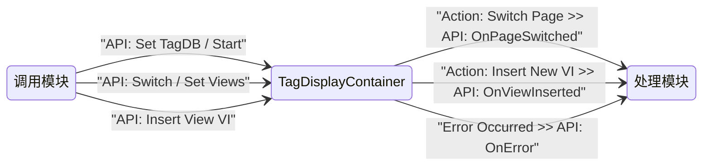

# `TagDisplayContainer` — CSM 模块接口文档

---

## 功能简述

`TagDisplayContainer` 是一个 CSM UI 模块，用于在一个容器前面板中管理和切换多个子视图（SubVI 页面）。它基于 TagDB 的标签数据驱动视图切换，支持预定义页面、动态插入/移除视图以及视图列表查询。

模块核心功能包括：绑定 TagDB 数据源、按标签值自动或手动切换页面、动态加载自定义 VI 作为子页面、管理视图生命周期。

---

## 模块信息

| 属性           | 值                                              |
| -------------- | ----------------------------------------------- |
| LabVIEW 版本   | ≥ 2020                                          |
| 支持的操作系统 | Windows                                         |
| 支持 RT        | ❌ 不支持                                       |
| 支持 64-bit    | ✅ 支持                                         |
| 所属模块组     | CSM-TagDBDisplayContainer.lvlib                  |

---

## 依赖项

| 依赖                                                                                                | 类型 |
| --------------------------------------------------------------------------------------------------- | ---- |
| [Communicable-State-Machine](https://github.com/NEVSTOP-LAB/Communicable-State-Machine)             | 必须 |
| [CSM-API-String-Arguments-Support](https://github.com/NEVSTOP-LAB/CSM-API-String-Arguments-Support) | 必须 |
| [CSM-INI-Static-Variable-Support](https://github.com/NEVSTOP-LAB/CSM-INI-Static-Variable-Support)   | 可选 |
| [TagDB](https://github.com/NEVSTOP-LAB/TagDB)                                                      | 必须 |
| [TagDB RefManager](https://github.com/NEVSTOP-LAB/TagDB)                                           | 必须 |

---

## API 接口（消息接口）

以下是外部调用者可以发送给本模块的消息。

### `API: Set TagDB`

绑定目标 TagDB 引用，建立与 TagDB 服务器的连接。

- **参数**：`APIString` — `String`：TagDB 引用名称或标识符
- **响应**：N/A

### `API: Start`

启动容器，加载默认页面并开始响应标签变化。

- **参数**：N/A
- **响应**：N/A

### `API: Stop`

停止容器，卸载当前页面并清理资源。

- **参数**：N/A
- **响应**：N/A

### `API: Switch`

根据指定的页面名称或路径切换到对应页面。

- **参数**：`APIString` — `String`：目标页面名称或 VI 路径
- **响应**：N/A

### `API: Switch2`

切换到指定页面（与 `API: Switch` 类似的备用切换接口，支持不同的页面匹配策略）。

- **参数**：`APIString` — `String`：目标页面名称或 VI 路径
- **响应**：N/A

### `API: List Views`

列出当前容器中所有已加载的视图页面。

- **参数**：N/A
- **响应**：`APIString` — `String`：以逗号分隔的视图名称列表

### `API: Set Views`

批量设置容器的视图集合（预定义页面 + 动态插入页面）。

- **参数**：`APIString` — `String`：视图配置字符串（格式：键值对，如 `View1=path/to/vi1.vi;View2=path/to/vi2.vi`）
- **响应**：N/A

### `API: Insert View VI`

向容器中动态插入一个新的子 VI 视图。

- **参数**：`APIString` — `String`：要插入的 VI 路径
- **响应**：N/A

### `UI: Front Panel State`

控制本模块前面板的显示状态。

- **参数**：`APIString` — `Enum`：`Open`、`Close` 或 `Minimize`
- **响应**：N/A

### `UI: Cursor Set`

设置前面板光标样式。

- **参数**：`APIString` — `Enum`：光标类型名称（如 `Busy`、`Default`）
- **响应**：N/A

### 参数类型说明

| 类型        | 说明                                                                                              |
| ----------- | ------------------------------------------------------------------------------------------------- |
| `APIString` | 支持嵌套键值对的纯文本字符串，需要 CSM API String Arguments Support 插件                          |
| `${变量名}` | INI 配置变量引用，需要 CSM INI Static Variable Support 插件                                       |

> **注意**：接口文档中对 `String` 类型数据统一使用 `APIString` 标注（不直接写 `SafeStr`），因为 `SafeStr` 正是 `APIString` 针对 `String` 类型的内部编码实现。

---

## 状态广播接口

以下是本模块**发出**的消息，用于通知订阅者内部状态变化。

### `Error Occurred`

**默认广播类型**：`Interrupt`

模块内部发生错误时广播。

- **参数**：`ErrStr` — `Error Cluster`：错误信息

### `Action: Switch Page`

**默认广播类型**：`Status`

页面切换完成时广播，携带新页面信息。

- **参数**：`APIString` — `String`：切换到的页面名称或路径

### `Action: Insert New VI`

**默认广播类型**：`Status`

新 VI 视图插入完成时广播。

- **参数**：`APIString` — `String`：插入的 VI 路径或名称

> - 使用 **`Status`** 表示正常的、预期中的状态转换。
> - 使用 **`Interrupt`** 表示需要立即关注的错误或事件。
> - 广播类型是发布方的默认行为；订阅方可通过 `-><register as Interrupt>` 语法修改接收类型。

---

## 调用限制与注意事项

> [!IMPORTANT]
>
> - `API: Set TagDB` **必须**在 `API: Start` 和其他任何操作 API 之前调用。
> - 本模块为**单例**——同一时间不可运行多个实例。
> - 使用 `API: Set Views` 批量配置视图时，会覆盖之前通过 `API: Insert View VI` 动态插入的视图。
> - 子 VI 页面必须兼容 CSM 框架的 SubVI 嵌入规范，确保前面板尺寸和接口匹配。

---

## 使用示例

> 将 `[模块名称]` 替换为启动模块 VI 时实际使用的名称。

### 基本生命周期

```csm
// 初始化并启动容器
API: Set TagDB >> MyTagDB -@ TagDisplayContainer
API: Start -@ TagDisplayContainer

// 切换到指定页面
API: Switch >> PageName -@ TagDisplayContainer

// 动态插入新视图
API: Insert View VI >> C:\Views\CustomView.vi -@ TagDisplayContainer

// 列出当前所有视图
API: List Views -@ TagDisplayContainer

// 停止容器
API: Stop -@ TagDisplayContainer
```

### 批量设置视图

```csm
// 使用键值对格式批量设置
API: Set Views >> Default=DefaultPage.vi;Chart=ChartView.vi;Table=TableView.vi -@ TagDisplayContainer
```

### 订阅状态广播

```csm
// 监听页面切换事件
Action: Switch Page@TagDisplayContainer >> API: OnPageSwitched@Logger -><register>

// 监听新VI插入事件
Action: Insert New VI@TagDisplayContainer >> API: OnViewInserted@Logger -><register>

// 取消订阅
Action: Switch Page@TagDisplayContainer >> API: OnPageSwitched@Logger -><unregister>
Action: Insert New VI@TagDisplayContainer >> API: OnViewInserted@Logger -><unregister>
```

---

## 模块交互图



---

## 备注

- 容器默认页面由 `DefaultPage.vi` 提供，在 `API: Start` 时自动加载。
- `ViewMgr` 类负责管理所有子视图（预定义页面和动态插入页面）的生命周期。
- `Action: Remove Inserted VI` 由模块内部触发，用于清理被移除的动态视图，不对外暴露为 API。

---

- _完整 CSM 语法参考：<https://github.com/NEVSTOP-LAB/Communicable-State-Machine/blob/main/.doc/Syntax.md>_
- _CSM Wiki：<https://nevstop-lab.github.io/CSM-Wiki/>_
